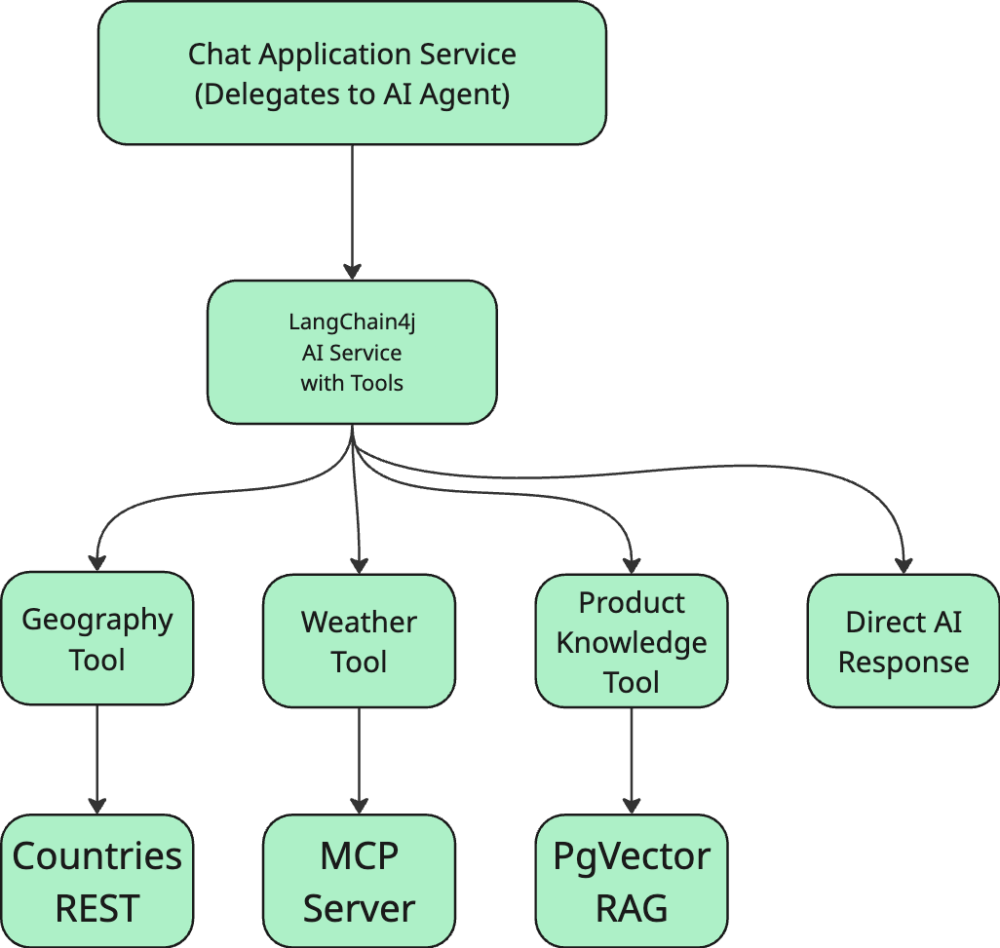

# AI Assistant

An intelligent AI Assistant built with Java and Spring Boot that demonstrates integration of multiple knowledge sources through an autonomous AI agent pattern. The system uses LangChain4j to orchestrate an AI agent that can intelligently select and use appropriate tools to answer user questions.

## Project Overview

This AI Assistant was built as a solution to integrate:
- **Local Vector Database** (PostgreSQL with pgvector) populated with CDQ Fraud Guard product information using RAG
- **Remote REST API** (RestCountries API) for geographical information
- **Local MCP Server** (Model Context Protocol) for weather data
- **Local LLM** (Ollama with qwen2.5:1.5b model)

### Architecture

The system follows a Domain-Driven Design (DDD) architecture with hexagonal architecture

**Key Design Decisions:**

1. **Autonomous AI Agent**: Uses LangChain4j's AI Services with @Tool annotations. The LLM autonomously decides which tools to call based on the user's question.

2. **Port-Adapter Pattern**: Domain logic is isolated from infrastructure concerns. All external integrations (REST APIs, databases, AI models) are accessed through port interfaces.

3. **RAG Implementation**: Product knowledge is scraped from the CDQ website, converted to embeddings using `nomic-embed-text`, and stored in PostgreSQL with pgvector for semantic search.

4. **MCP Integration**: Weather data is accessed through a MCP server, demonstrating modern AI tool integration patterns.

## Technology Stack

- **Java 21** with Spring Boot 3.3.5
- **LangChain4j 0.36.2** - AI orchestration framework with autonomous agent pattern
- **Ollama** - Local LLM runtime
  - `qwen2.5:1.5b` - Chat model (optimized for performance on consumer hardware)
  - `nomic-embed-text` - Embedding model (768 dimensions)
- **PostgreSQL 17** with pgvector extension - Vector database for RAG
- **Spring Data JPA** - Database access
- **WebClient** - Reactive HTTP client for external APIs
- **Jsoup** - HTML parsing for web scraping

## Prerequisites

- **Java 21** (JDK 21 or higher)
- **Docker** (for running PostgreSQL, Ollama, and pgAdmin)
- **Gradle** (wrapper included in project)

## Quick Start

### 1. Start The Project Services
Add an .env file in [mcp-weather-http](mcp-weather-http) with:
- WEATHER_API_URL=https://api.weatherapi.com/v1/current.json
- OPENWEATHER_API_KEY=your_api_key_here

The project includes a convenience script that starts all required services (PostgreSQL, Ollama, pgAdmin, MCP Weather Server) and sets up the environment:

```bash
./start.sh
```

This script will:
- Start Docker containers (PostgreSQL with pgvector, Ollama, pgAdmin)
- Wait for services to be ready
- Pull required Ollama models (`qwen2.5:1.5b` and `nomic-embed-text`)
- Set up and start the MCP Weather Server on port 3333

**Note**: First run will take 5-10 minutes to download Ollama models.

### 2. Build and Run the Application

```bash
# Build the project
./gradlew clean build

# Run the application
./gradlew bootRun
```

The application will:
- Start on `http://localhost:8080`
- Connect to PostgreSQL database `aiassistant`
- Automatically scrape CDQ Fraud Guard product information and create embeddings on first run
- Register AI tools with the LangChain4j agent

### 3. Test the AI Assistant

Use the REST API to ask questions:

```bash
# Example 1: Geography question (uses RestCountries API)
curl -X POST http://localhost:8080/api/chats \
  -H "Content-Type: application/json" \
  -d '{"question": "What is the capital city of Germany?"}'

# Example 2: Weather question (uses MCP Weather Server)
curl -X POST http://localhost:8080/api/chats \
  -H "Content-Type: application/json" \
  -d '{"question": "What is the temperature currently in Munich?"}'

# Example 3: Combined geography + weather (uses both tools)
curl -X POST http://localhost:8080/api/chats \
  -H "Content-Type: application/json" \
  -d '{"question": "What is the temperature of the capital of Germany currently?"}'

# Example 4: City information (uses RestCountries API)
curl -X POST http://localhost:8080/api/chats \
  -H "Content-Type: application/json" \
  -d '{"question": "What do you know about Berlin?"}'

# Example 5: Product knowledge (uses RAG)
curl -X POST http://localhost:8080/api/chats \
  -H "Content-Type: application/json" \
  -d '{"question": "What is the AML Guard?"}'
```

### 4. Stop Services

To stop all services cleanly:

```bash
./stop.sh
```

This will stop the Spring Boot application, MCP server, and Docker containers.

## Running Tests

```bash
# Run all tests
./gradlew test
```

**Note**: Integration tests require Docker services to be running (`./start.sh` first).

## Configuration

### Application Configuration (`src/main/resources/application.yml`)

```yaml
spring:
  datasource:
    url: jdbc:postgresql://localhost:5432/aiassistant
    username: postgres
    password: postgres

langchain4j:
  ollama:
    chat-model:
      base-url: http://localhost:11434
      model-name: qwen2.5:1.5b
      temperature: 0.7
      timeout: 120s
    embedding-model:
      base-url: http://localhost:11434
      model-name: nomic-embed-text
      timeout: 120s

rag:
  ingestion:
    cdq-fraud-guard:
      url: https://www.cdq.com/products/cdq-fraud-guard

external-api:
  rest-countries:
    base-url: https://restcountries.com/v3.1
```

### Docker Services (`docker/stack.yml`)

- **PostgreSQL 17**: Port 5432 with pgvector extension
- **Ollama**: Port 11434 for LLM serving
- **pgAdmin**: Port 5050 for database management (admin@admin.com / admin)

### MCP Weather Server

Python-based MCP server running on port 3333, providing weather information through the Model Context Protocol.

## How It Works


### AI Agent Flow

1. **User sends question** -> REST API (`POST /api/chats`)
2. **ChatApplicationService** -> Calls `AiPort.answer()`
3. **LangChainAiAdapter** -> Invokes LangChain4j AI Service
4. **LLM (qwen2.5:1.5b)** -> Analyzes question and autonomously decides which tools to use
5. **Tool Execution** -> LangChain4j calls appropriate `@Tool` methods:
   - Geography questions -> `GeographyTool` -> RestCountries API
   - Weather questions -> `WeatherTool` -> MCP Server
   - Product/AML questions -> `ProductKnowledgeTool` -> PgVector RAG search
6. **LLM synthesizes response** -> Combines tool results into natural language
7. **Response returned** -> Through adapter layers back to REST API

### RAG (Retrieval-Augmented Generation) Flow

1. **Ingestion** (on application startup):
   - Scrape CDQ Fraud Guard page
   - Extract main content (product descriptions, features)
   - Split into semantic chunks
   - Generate embeddings (768-dim vectors)
   - Store in PostgreSQL with pgvector

2. **Query** (when user asks about CDQ products):
   - Convert question to embedding
   - Similarity search in PgVector (cosine similarity)
   - Retrieve top-3 most relevant chunks (score > 0.5)
   - Pass to LLM as context
   - LLM generates answer based on retrieved information

## Development Notes

### AI Usage Disclosure

This project was developed with AI assistance (GitHub Copilot) for:
- writing from scratch the MCP Weather Server
- boilerplate creation
- Fine-tuning AI prompts
- Help in documentation writing
- Debugging and problem-solving

### Why LangChain4j Instead of Embabel?

The task recommended using Embabel, however:
- Embabel Agent framework had dependency conflicts with Spring AI
- LangChain4j provides mature, production-ready AI orchestration
- Better documentation and community support
- Native integration with Ollama
- Cleaner API for tool-based agents

LangChain4j was chosen for its stability and better alignment with the project requirements.

### Model Selection

**Chat Model: qwen2.5:1.5b**
- Lightweight model suitable for consumer hardware
- Acceptable reasoning quality for the task
- Acceptable response times
- Tried `qwen2.5:3b` but was way too slow for my Mac and I encountered frequent timeout issues

**Embedding Model: nomic-embed-text**
- 768 dimensions
- Optimized for semantic similarity
- Good balance of quality and speed

### What could be improved
- Add caching layer for frequently asked questions
- Enhance error handling for external API failures
- Expand RAG knowledge base with more CDQ products
- Tune LLM parameters for better response quality e.g. RAG tuning, a bigger model
- Clean the AI responses to remove unnecessary line breaks or formatting issues

## Usage Examples
```bash
curl -X POST http://localhost:8080/api/chats \
  -H "Content-Type: application/json" \
  -d '{"question": "What is the capital city of Germany?"}'
{"answer":"The capital city of Germany is Berlin."}

curl -X POST http://localhost:8080/api/chats \
  -H "Content-Type: application/json" \
  -d '{"question": "What is the temperature currently in Munich?"}'
{"answer":"The current temperature in Munich is -10.0°C."}

curl -X POST http://localhost:8080/api/chats \
  -H "Content-Type: application/json" \
  -d '{"question": "* What is the temperature of the capital of Germany currently?"}'
{"answer":"The temperature in the capital city of Germany, Berlin, is currently -6.29°C."}

curl -X POST http://localhost:8080/api/chats \
  -H "Content-Type: application/json" \
  -d '{"question": " What do you know about Berlin?"}'
{"answer":"Certainly! Berlin is the capital city of Germany. It's located in Central Europe and has a population of approximately 83,491,249 people. The currency used there is the Euro (EUR)."}%  

curl -X POST http://localhost:8080/api/chats \
  -H "Content-Type: application/json" \
  -d '{"question": "What is the CDQ Fraud Guard?"}'
{"answer":"CDQ Fraud Guard is an advanced payment fraud detection tool designed specifically for businesses. It utilizes a shared database of validated bank accounts to verify new account information before it's used in transactions, significantly reducing the risk of fraudulent activities such as payment scams and invoice fraud. By providing a trust score based on successful transactions, CDQ Fraud Guard helps streamline the verification process and ensures that only trusted financial partners can operate within your business. This tool integrates seamlessly with existing systems, improving operational efficiency without requiring additional resources or interface changes.\n\nIt's designed to help businesses protect their financial processes from payment fraud by leveraging community-shared data on known fraud cases and verified bank accounts. The key features include:\n\n- **Bank Account Verification**: Utilizes a shared database of validated bank accounts to verify new account information.\n- **Trust Score**: Assigns a trust score based on the number of successful transactions, allowing you to adjust risk appetite.\n- **Payment Fraud Alerts**: Warns community members about potential fraud attacks by maintaining and sharing known fraud cases.\n- **Fraud Case Management**: Allows users to document, manage, and look up fraud cases for critical account identification.\n\nOverall, CDQ Fraud Guard is a comprehensive solution designed to simplify the creation and verification of customer and supplier master data while enhancing security measures against financial crimes. It aims to ensure that your transactions are safe from payment fraud, thereby safeguarding business operations effectively."}%  

curl -X POST http://localhost:8080/api/chats \
  -H "Content-Type: application/json" \
  -d '{"question": "What is the AML Guard? "}'
{"answer":"The AML Guard is an enhanced security solution designed specifically for protecting against money laundering activities. This product utilizes a collaborative database of verified bank accounts and known fraud cases to identify and prevent fraudulent transactions accurately. By ensuring the integrity of your financial processes, it helps safeguard against payment fraud effectively. The system assigns a trust score based on transaction records and alerts community members about potential fraud risks, thereby streamlining the verification process and enhancing operational efficiency. This tool is particularly beneficial for businesses looking to enhance their security measures against the growing threat of fraudulent activities in the digital age."}%   

curl -X POST http://localhost:8080/api/chats \
  -H "Content-Type: application/json" \
  -d '{"question": "Tell me about fraud detection in CDQ"}'
{"answer":"The document you requested discusses various aspects related to CDQ Fraud Guard's role in detecting and preventing payment fraud. It highlights how this tool combines advanced verification systems with a shared database of verified bank accounts and known fraud cases to ensure the security and reliability of financial transactions.\n\nKey features mentioned include:\n- **Bank Account Verification**: Using a shared database for verifying new bank account information before it is used.\n- **Trust Score**: Assigning a trust score based on successful transaction history, which can be customized according to risk appetite.\n- **Payment Fraud Alerts**: Providing community members with warnings about potential fraud attacks by sharing known fraud cases.\n- **Fraud Case Management**: Allowing users to manage and document fraud cases for identifying critical accounts and preventing further fraudulent activity.\n\nThe document also mentions a few key points that business owners can take advantage of:\n- It integrates seamlessly with existing financial systems, enhancing workflow efficiencies without requiring a dedicated interface.\n- It uses community-shared data on validated bank accounts to help identify and prevent fraud attacks effectively.\n\nThese features collectively contribute to CDQ Fraud Guard's effectiveness in combating payment fraud through enhanced security measures."}

curl -X POST http://localhost:8080/api/chats \
  -H "Content-Type: application/json" \
  -d '{"question": "What is CDQ Fraud Guard?"}'
{"answer":"CDQ Fraud Guard is an advanced payment fraud detection tool designed to protect businesses from various types of fraudulent activities. It uses a shared database of validated bank accounts and known fraud cases to verify new bank account information before it's used for operational purposes. This ensures the security and reliability of financial transactions by reducing the risk of payment fraud. Additionally, CDQ Fraud Guard provides detailed insights into payment fraud alerts and manages fraud cases seamlessly within an existing financial system, enhancing overall business compliance and efficiency."}  
```
